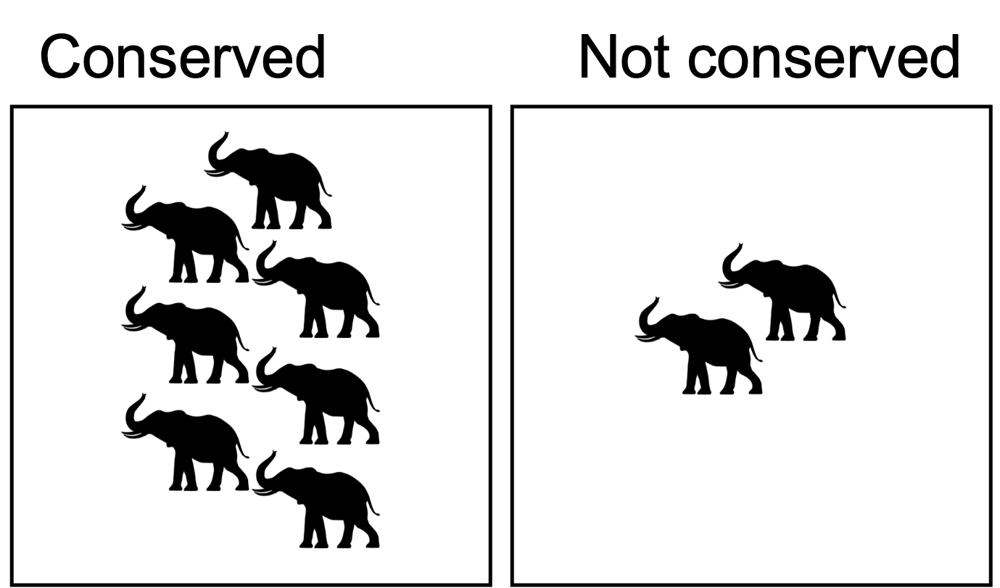
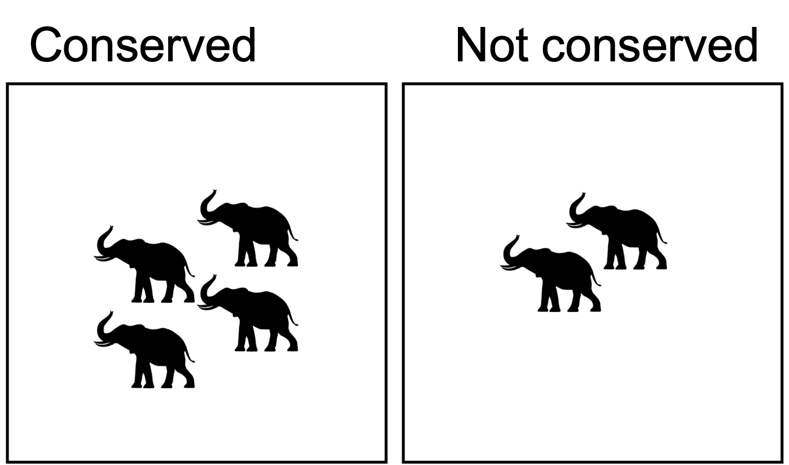

<!-- https://raw.githack.com/edrubin/EC421W19/master/LectureNotes/11InstrumentalVariables/11_instrumental_variables.html#38 -->

# Background

About the job:

- Asst Prof in Human Dimensions of Biodiversity Concervation at UBC

- Joint appointment at:
  - Food and Resource Economics (FRE; mostly economists)
  - Institute for Resources, Environment and Sustainability (IRES; mostly non-economists)

- Part of a 5-person cluster hire
  - 4 already hired last year
  - Failed search last year

---

# Background

- Intended for an upper-level undergraduate class (e.g. FRE 474)

- The use of Instrumental Variables as a quasi-experimental method for causal inference

- The use of this method for understanding environmental solutions, either from your own research or from other published work.

- Assume your “students” have a basic understanding of the method.

- Highlight:
  - the problems with the use of ordinary least square regression while estimating the coefficient on an endogenous regressor and,
  - the conditions necessary for a valid instrument for an endogenous regressor
  
- Timeline:
  - 20 min for mock lecture
  - 5 min for clarifying questions from the class
  - 25 min for audience (search committee, LFS and IRES faculty, and students) to ask questions about your approach to teaching

---
# Today's class:

One-sentence summary: 

>**IV regression** is a general way to obtain a consistent estimator of the unknown coefficients of the population regression function when the **regressor $X$ is correlated with the error term $u$** (_i.e._ $X$ is endogenous!).


--

- Think of the variation in $X$ as having two parts:

  - endogenous (bad, biases our results)
  - exogenous (good)


--
- The *instrument* (some other variable, $Z$) allows us to isolate the **exogenous** variation in $X$


--
- No free lunch. A _valid_ instrument must meet some necessary conditions

---
# Today's class:

- Motivation for IV

--
- Review of causality and endogeneity

--
- IV implementation:

  - Why and how IV regression works
  
  - Conditions for a valid instrument
  
  - Estimation via 2SLS

---
# Endogeneity

Endogeneity arises:

- Omitted variables

- Errors in variables

- Simultaneous causality

  - Nature is full of feedbacks
  
  - Causality runs _both ways_
  
  - Even if we observe the entire system, multiple regression cannot eliminate bias

---
# Motivation

## Deforestation & Malaria (McDonald & Mordecai, 2019)

<!-- Importantly, ignoring this statistically well supported feedback leads to substantial underestimates of the true effect of deforestation on malaria transmission, which may have confounded the results of earlier studies -->

What is the effect of deforestation on malaria incidence?

```{r, echo = F, out.height=200, fig.align='center'}

```

--

$$
\Large{Y_i = \alpha + \beta X_i + \epsilon_i}
$$

- $X_i$ Deforestation (area of forest lost in $i$)
- $Y_i$ Malaria incidence (number of Malaria cases in $i$)

---
# Motivation

## Deforestation & Malaria (McDonald & Mordecai, 2019)

Bidirectional feedback between deforestation and malaria

```{r, echo = F, out.height=200, fig.align='center'}

```

--
> Deforestation promotes malaria via ecological mechanisms, but **local epidemics of malaria reduce forest clearing** because poor health reduces economic activity

--

Sounds like simultaneity bias

---
# Endogeneity: Problem

The deforestation-malaria system:

$$
\begin{split}
Y_i &= \alpha + \beta X_i + \epsilon_i \\
X_i &= \theta + \gamma Y_i + \mu_i
\end{split}
$$

- Imagine $\epsilon_i > 0$

--

- This increases $Y_i$

--

- A higher $Y_i$ _decreases_ $X_i$ (because $\gamma < 0$)

--

- $X_i$ and $\epsilon_i$ are correlated:  $\mathrm{cov}(X_i, \epsilon_i) = \frac{\gamma\sigma_\epsilon^2}{1 - \gamma\beta}$ .right[[Show me how](#simultaneity-bias)]

--

.center[How do we estimate the effect of deforestation on malaria incidence?]


---
# Endogeneity: Solutions

Two solutions exist:

--

- Randomized controlled experiment (unethical and unfeasible)

--

- Separate the exogenous part of $X$ from the endogenous part of $X$:

--

  - Imagine that we can split deforestation into an exogenous part and an endogenous part:

$$
\begin{split}
Y_i &= \alpha + \beta X_i + \epsilon_i \\
&= \alpha + \beta \left(X_i^{\text{Exo}} + X_i^{\text{Endo}}\right) + \epsilon_i \\
&= \alpha + \beta X_i^{\text{Exo}} + \underbrace{\beta X_i^{\text{Endo}} + \epsilon_i}_{\varepsilon_i}\\
Y_i &= \alpha + \beta X_i^{\text{Exo}} + \varepsilon_i
\end{split}
$$
--

  - We could use this exogenous variation in deforestation to consistently estimate $\beta$

--

.center[What would exogenous variation in deforestation mean?]

---
# Endogoneity: Solutions

.center[What would exogenous variation in deforestation mean?]

--

> Changes in deforestation that are random — or at least not caused by malaria incidence

--

.center[How do we isolate this exogenous variation in our deforestation?]

--

>Find an instrument (an instrumental variable): $Z$

--

$$
Y_i = \alpha + \beta X_i + \epsilon_i
$$


An instrument is a variable that is:

- **Correlated** with the explanatory variable of interest (relevant)

$$
\mathrm{cov}(X_i, Z_i) \neq 0
$$

- **Uncorrelated** with the disturbance (exogenous)

$$
\mathrm{cov}(Z_i,\epsilon_i) = 0
$$

---
# Instrumental Variables

*Relevance:* We need the instrument to cause a change in (correlate with) our endogenous explanatory variable.


--
Some examples


--
.pull-left[Potential instrument] .pull-right[Relevant?]

.pull-left[Social security number of plot owner]
--
.pull-right[**Probably not relevant**]
.pull-right[Uncorrelated with deforestation]
--
.pull-left[Quality of timber]
--
.pull-right[**Probably relevant**]
.pull-right[Quality may correlate with incentives to cut]
--
.pull-left[Aerosol pollution]
--
.pull-right[**Relevant**]
.pull-right[Highly correlated with deforestation]

---
# Instrumental Variables

*Exogenous:* The instrument has to be independent of omitted factors that affect our outcome variable — as good as randomly assigned


--
Some examples


--
.pull-left[Potential instrument] .pull-right[Exogenous?]

.pull-left[Social security number of plot owner]
--
.pull-right[**Exogenous**]
.pull-right[Independent of other factors of deforestation]
--
.pull-left[Quality of timber]
--
.pull-right[**Not exogenous**]
.pull-right[Access to better quality = beter revenues = better health status]
--
.pull-left[Aerosol pollution]
--
.pull-right[**Exogenous**]
.pull-right[It's as-if random,a t least w.r.t. malaria transmission]

---
# Instrumental Variables: Recap


- Our instrument must be **correlated with our endogenous variable**

--


- Our instrument must be **uncorrelated with any other variable that affects the outcome**

--


- You must be able to form a cohesive story


--

.center[The instrument only affects our outcome through the endogenous variable]

---
# Instrumental Variables: Back to deforestation and malaria

Our potential instruments were:

.pull-left[Social security number of plot owner]
--
.pull-right[**Probably not relevant**]
.pull-right[**Exogenous**]
--
.pull-left[Quality of timber]
--
.pull-right[**Probably relevant**]
.pull-right[**Not exogenous**]
--
.pull-left[Aerosol pollution]
--
.pull-right[**Relevant**]
.pull-right[**Exogenous**]


---
class:inverse,center,middle
# If we have a valid instrument, how do we use it?

---
# Estimation

## Two-stage least squares: 2SLS

Why does this work?

First stage:

$$
X_i = \pi_0 +\pi_1 Z_i + \omega_i
$$

--

$$
\hat{X_i} = \hat{\pi_0} + \hat{\pi_1} Z_i
$$

--

Note that $\hat{X_i}$ no longer contains an error term (  $\varepsilon_i = \gamma Y_i + \epsilon_i$ )

--

Second stage:

$$
Y_i = \alpha + \beta\hat{X_i} + \epsilon_i
$$


.right[[Show me how](2SLS)]

---
# App

---
# Admin

## Assignment:

- Blah

- Blah

## Next class:

- Whatever made up stuff in here

---
class:center,middle,inverse
#<\LECTURE>

---
class:inverse,center

# Extra

-[Simultaneity bias](#simultaneity-bias)

-[OBV example](#obv-example)

---
name: simultaneity-bias
# Simultaneity bias

Recall:

$$
\begin{align}
Y_i &= \alpha + \beta X_i + \epsilon_i \\
X_i &= \theta + \gamma Y_i + \mu_i
\end{align}
$$

$$
\begin{align}
\mathrm{cov}(X_i, \epsilon_i) &= \mathrm{cov}(\theta + \gamma Y_i + \mu_i, \epsilon_i)\\
&= \gamma\mathrm{cov}(Y_i,\epsilon_i) + \mathrm{cov}(\mu_i, \epsilon_i) \: \text{...................Assume } \mathrm{cov}(\mu_i, \epsilon_i) = 0 \: \text{, and substitute } Y_i\\
&= \gamma\mathrm{cov}(\alpha + \beta X_i + \epsilon_i, \epsilon_i) \\
&= \gamma\beta\mathrm{cov}(X_i,\epsilon_i) + \gamma\sigma_\epsilon^2\\
\mathrm{cov}(X_i, \epsilon_i) &= \frac{\gamma\sigma_\epsilon^2}{1 - \gamma\beta}
\end{align}
$$

---
name:obv-example
# OBV Example: Conservation and elephant abundance

```{r, out.height=350, echo = F}

```

---
# OBV Example: Conservation and elephant abundance

```{r, echo = F, out.height=350, fig.align='center'}

```

But what if this was the past?

- Our estimate = 5 
- Treatment effect = 3

---
# OBV Example: Conservation and elephant abundance

```{r, echo = F, out.height=350, fig.align='center'}

```

But what if **this** was the past?

- Our estimate = 5
- Treatment effect = 6

---
# Endogeneity

## Consider the following DAG

```{r, echo = FALSE, fig.height=3, eval = F}
library(ggdag)
library(ggplot2)

dagify(Y ~ D,
       Y ~ e,
       D ~ A,
       #D ~ Z,
       outcome = "Y",
       exposure = "D",
       latent = "A") %>%
  ggdag(layout = "circle", stylized = F) +
  theme_void()
```


--


The data-generating process is:

$$Y = \alpha + \beta_1 D + \beta_2 A + \epsilon$$

--

---

# How real is this example?

Consider the problem faced by McDonald et al

- $D_i$ is observable (*i.e.* purple areas imply $D_i = 1$)
- $Y_i$ is observable (*i.e.* Let's go to Mexico an do ecological surveys)
- We don't know why $D_i = 1$ for some
- We don't observe $A_i$ (*i.e.* We have no idea of the decision-making process that led owners to conserve)

---
# Endogeneity

## What does it mean to say we have an **endogenous regressor**?

Since we don't observe $A$, and our estimation model is:

$$Y = \alpha + \beta_1 D + \mu$$

With beause $\mu = \beta_2 A + \epsilon$

Because $D$ is a function of $A$

--

DAG here

--

Biased estimates = poorly informed policy


--- 
.name:2SLS
# Instrumental Variables

## Example

$$
\hat{\beta_1} = \frac{C(N,D)}{V(D)} = \frac{E[ND]-E[N]E[D]}{V(S)}
$$
--
Let's substitute $N$:

$$
\begin{split}
\hat{\beta_1} &= \frac{E[\beta_0D + \beta_1D^2 + D\beta_2Q + \epsilon]-E[N]E[\beta_0 + \beta_1D + \beta_2Q + \epsilon]}{V(S)}\\
&= \frac{\beta_1 E(D^2) - \beta_1E(D)^2 + \beta_2E(QD) -\beta_2 E(D)E(Q) + E(Du) - E(D)E(u)}{V(S)}\\
&=\beta_1 + \beta_2\frac{C(QD)}{V(D)}
\end{split}
$$
--
If $\beta_2 \neq 0$ and $C(QD) > 0$, we're in trouble

---
# Instrumental Variables

Let’s assume that you have found a really great weird instrument $Z_i$ that causes land owners to conserve, but that is independent of habitat quality and the structural error term.

$$
\begin{split}
C(NZ) &= C((\beta_0D + \beta_1D^2 + D\beta_2Q + \epsilon),Z)\\
&= E((\beta_0D + \beta_1D^2 + D\beta_2Q + \epsilon)Z) - E(D)E(S)\\
&= \beta_0[E(Z)-\beta_0E(Z)] + \beta_1[E(DZ) - E(D)E(Z)] + \beta_2[E(QZ)-E(Q)E(Z)] + [E(uZ) - E(u)E(Z)]\\
&= \beta_1C(DZ) + \beta_2C(QZ) +C(uZ)
\end{split}
$$

--

If $C(DZ) = 0$ and $C(uZ) = 0$

--

Then

$$
\begin{split}
C(NZ) &= \beta_1C(DZ)\\
\beta_1 &= \frac{C(NZ)}{C(DZ)}
\end{split}
$$


