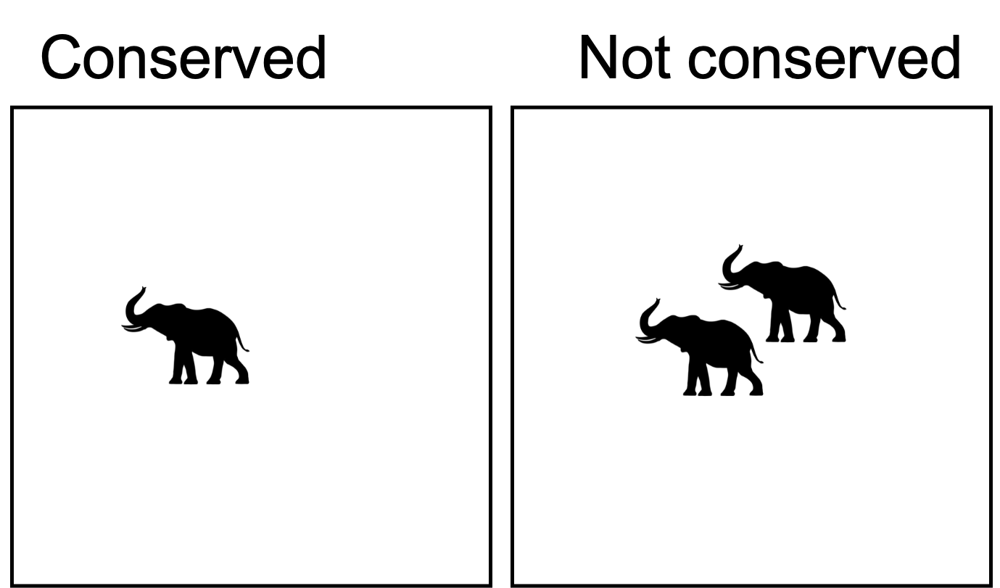

<!-- https://raw.githack.com/edrubin/EC421W19/master/LectureNotes/11InstrumentalVariables/11_instrumental_variables.html#38 -->

# Background

About the job:

- Asst Prof in Human Dimensions of Biodiversity Concervation at UBC

- Joint appointment at:
  - Food and Resource Economics (FRE; mostly economists)
  - Institute for Resources, Environment and Sustainability (IRES; mostly non-economists)

- Part of a 5-person cluster hire
  - 4 already hired last year
  - Failed search last year

---

# Background

- Intended for an upper-level undergraduate class (e.g. FRE 474)

- The use of Instrumental Variables as a quasi-experimental method for causal inference

- The use of this method for understanding environmental solutions, either from your own research or from other published work.

- Assume your “students” have a basic understanding of the method.

- Highlight:
  - the problems with the use of ordinary least square regression while estimating the coefficient on an endogenous regressor and,
  - the conditions necessary for a valid instrument for an endogenous regressor
  
- Timeline:
  - 20 min for mock lecture
  - 5 min for clarifying questions from the class
  - 25 min for audience (search committee, LFS and IRES faculty, and students) to ask questions about your approach to teaching

---

# Today's class:

## Illustrate the use of IV for answering environmental questions


- Motivation for IV

- Review of causality

- Review on endogeneity

- IV implementation

---
# Motivation

```{r, echo = F, out.height=350, fig.align='center'}

```

--

What is the effect of **conservation** on Elephant **abundance**?

Conclusion: Conservation = 5 elephants

---
# Motivation

```{r, echo = F, out.height=350, fig.align='center'}

```

But what if this was the past?

- Our estimate = 5 
- Treatment effect = 3

---
# Motivation

```{r, echo = F, out.height=350, fig.align='center'}

```

But what if **this** was the past?

- Our estimate = 5
- Treatment effect = 6

---
class: inverse, middle

# Causality

## A quick review

---

# Review: Causality

## Notation

$y_{1i}$: The outcome for unit $i$ if it had received treatment (_i.e._ $D_i = 1$)

$y_{0i}$: The outcome for unit $i$ if it **did not** receive the treatment (_i.e._ $D_i = 0$)

--

## The fundamental problem of causal inference:

--

- We do not observe $y_{1i}$ and $y_{0i}$

--

- We considered comparing the outcomes of treated vs untreated units:

$$\tau = Avg(y_i | D_i = 1) - Avg(y_i | D_i = 0)$$
--

- We covered a series of assumptions that would allow us to do that

---

# Review: Causality

## Selection bias

<!-- The average untreated outcome for a member of our treatment group (which we cannot observe) differs from the average untreated outcome for a member of our control group -->


$$Avg(y_i | D_i = 1) - Avg(y_i | D_i = 0) = \tau + Avg(y_{0,i} | D_i = 1) - Avg(y_{0,i} | D_i = 0)$$

--

- Our treatment variable is correlated with *something* that makes the two groups different.

--

- We don't observe this *something*

--

- Selection bias means our treatment and control groups differ on some unobserved/omitted dimension. (Endogeneity)

--

- How big of a problem is this?

---
class: inverse, middle

# Unfortunately, humans are quite good at optimizing

## Endogeneity is prevalent

## Biases our results

---

# Instrumental Variables

- **Instrumental variables** (IV) is one way of estimating the _causal effect_ of a treatment or program

--

- Instrumental variables attempts to separate out: 

  - The endogenous part of $D_i$, which biases our results

--

  - The exogenous part of $D_i$, which gives us unbiased estimates (what we care about)

--

If we use only the exogenous (good) variation in $x$, then we can avoid selection bias/omitted-variable bias

---

# Instrumental Variables

## Example

If we want to estimate the effect of conservation on elephant abundance:

$$
N_i = \beta_0 + \beta_1D_i + u_i
$$

--

We would love to calculate $N_{1,i} - N_{0,i}$, but we can't.

--

And OLS will likely be biased due to selection/omitted-variable bias.

---

---
# Instrumental Variables

## Example 

The real data-generating process is

$$
N_i = \beta_0 + \beta_1D_i + \beta_2Q_i + \epsilon_i
$$

But we typically would do:

$$
N_i = \beta_0 + \beta_1D_i+ u_i
$$

--

Recall

$$
\hat{\beta_1} = \frac{C(N,D)}{V(D)} = \frac{E[ND]-E[N]E[D]}{V(S)}
$$

---
# Instrumental Variables

## Example

$$
\hat{\beta_1} = \frac{C(N,D)}{V(D)} = \frac{E[ND]-E[N]E[D]}{V(S)}
$$
--
Let's substitute $N$:

$$
\begin{split}
\hat{\beta_1} &= \frac{E[\beta_0D + \beta_1D^2 + D\beta_2Q + \epsilon]-E[N]E[\beta_0 + \beta_1D + \beta_2Q + \epsilon]}{V(S)}\\
&= \frac{\beta_1 E(D^2) - \beta_1E(D)^2 + \beta_2E(QD) -\beta_2 E(D)E(Q) + E(Du) - E(D)E(u)}{V(S)}\\
&=\beta_1 + \beta_2\frac{C(QD)}{V(D)}
\end{split}
$$
--
If $\beta_2 \neq 0$ and $C(QD) > 0$, we're in trouble

---
# Instrumental Variables

Let’s assume that you have found a really great weird instrument $Z_i$ that causes land owners to conserve, but that is independent of habitat quality and the structural error term.

$$
\begin{split}
C(NZ) &= C((\beta_0D + \beta_1D^2 + D\beta_2Q + \epsilon),Z)\\
&= E((\beta_0D + \beta_1D^2 + D\beta_2Q + \epsilon)Z) - E(D)E(S)\\
&= \beta_0[E(Z)-\beta_0E(Z)] + \beta_1[E(DZ) - E(D)E(Z)] + \beta_2[E(QZ)-E(Q)E(Z)] + [E(uZ) - E(u)E(Z)]\\
&= \beta_1C(DZ) + \beta_2C(QZ) +C(uZ)
\end{split}
$$

--

If $C(DZ) = 0$ and $C(uZ) = 0$

--

Then

$$
\begin{split}
C(NZ) &= \beta_1C(DZ)\\
\beta_1 &= \frac{C(NZ)}{C(DZ)}
\end{split}
$$

---
# Estimation

-2SLS

---
# Next class

IV with heterogenous treatment effects

---
class:center

Extra

---

# Consider two plots of land
--
- Single binary treatment ("consrvation")
- We are interested in the effect of conservation on number of elephants

--
$Y_{1,0} = 10$
$Y_{1,1} = 40$
$Y_{2,0} = 40$
$Y_{2,1} = 70$

--

Since the goal of the conservation program is to maximize the number of elephants in the world, we would want conserve plot 2

The only thing you observe is this world:


---
# Endogeneity

## Consider the following DAG

```{r, echo = FALSE, fig.height=3, eval = F}
library(ggdag)
library(ggplot2)

dagify(Y ~ D,
       Y ~ e,
       D ~ A,
       #D ~ Z,
       outcome = "Y",
       exposure = "D",
       latent = "A") %>%
  ggdag(layout = "circle", stylized = F) +
  theme_void()
```


--


The data-generating process is:

$$Y = \alpha + \beta_1 D + \beta_2 A + \epsilon$$

--

---

# How real is this example?

Consider the problem faced by McDonald et al

- $D_i$ is observable (*i.e.* purple areas imply $D_i = 1$)
- $Y_i$ is observable (*i.e.* Let's go to Mexico an do ecological surveys)
- We don't know why $D_i = 1$ for some
- We don't observe $A_i$ (*i.e.* We have no idea of the decision-making process that led owners to conserve)

---
# Endogeneity

## What does it mean to say we have an **endogenous regressor**?

Since we don't observe $A$, and our estimation model is:

$$Y = \alpha + \beta_1 D + \mu$$

With beause $\mu = \beta_2 A + \epsilon$

Because $D$ is a function of $A$

--

DAG here

--

Biased estimates = poorly informed policy

---
# Endogeneity

Something here

---
# A solution

Enter the `Instrumental Variable`

Conditions necessary for a valid instrument:

- Relevance

- Exclusion-restriction

- A good story

The IV affects outcome only through the treatment

---
Sow how this solves the issue

---
# Estimation

Two-stage least squares

# Today's causal effect of interest

---
class: inverse, middle

# Next class

## Moving in time: Difference-in-Differences


