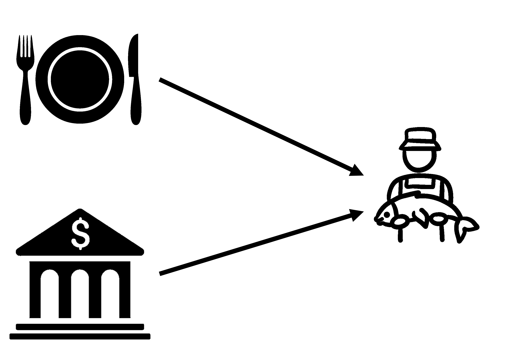
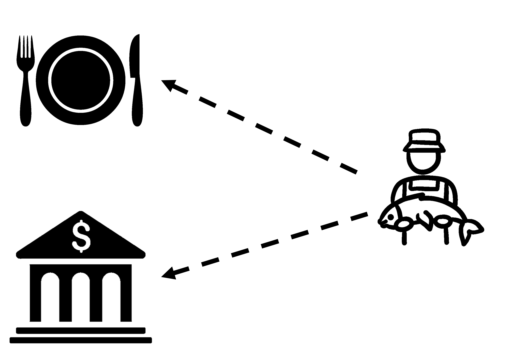
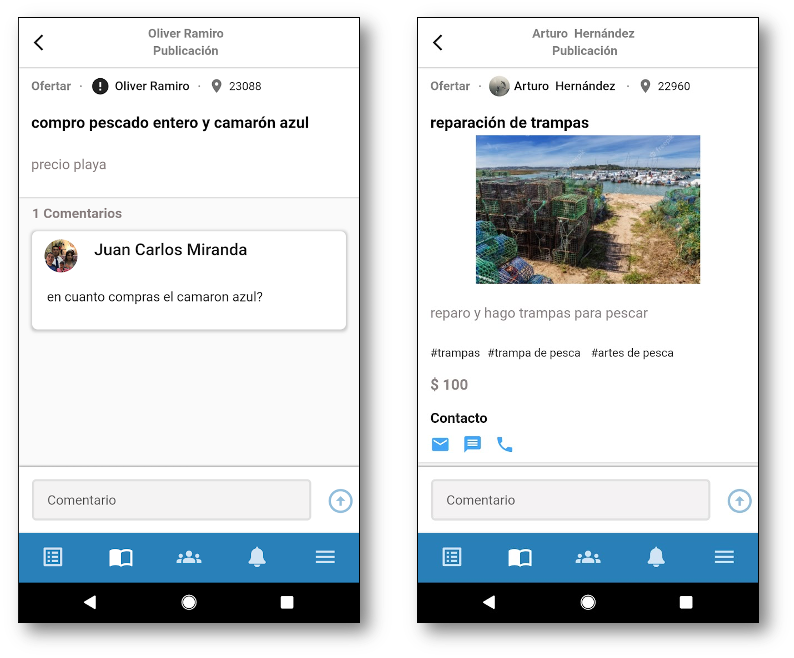
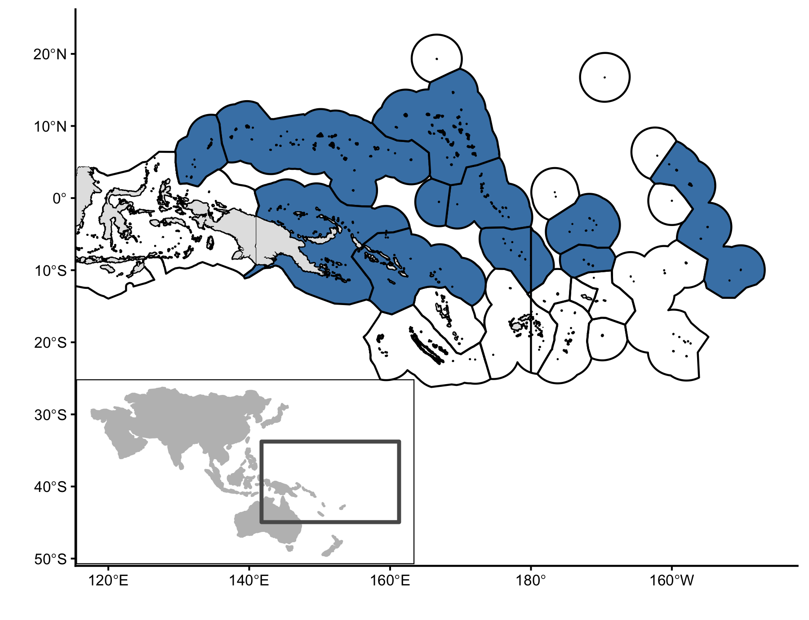
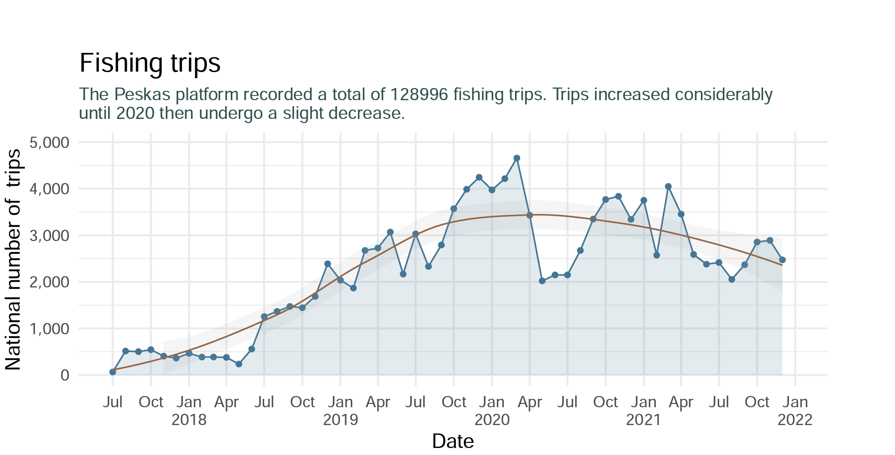
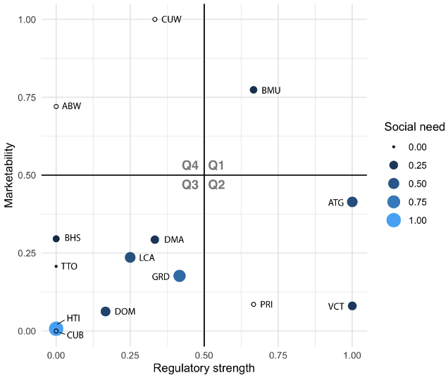

<style type="text/css">
.small {
    font-size: 70%;
    padding: 1em 4em 1em 4em;
}
</style>

<style type="text/css">
.medium {
    font-size: 1.5rem;
    padding: 1em 1em 1em 1em;
}
</style>

<style type="text/css">
.large {
    font-size: 2rem;
    padding: 1em 1em 1em 1em;
}
</style>

```{r setup, include=FALSE, eval = T}
options(htmltools.dir.version = FALSE)
knitr::opts_chunk$set(
  fig.width=9, fig.height=3.5, fig.retina=3,
  out.width = "10%",
  cache = FALSE,
  echo = FALSE,
  message = FALSE, 
  warning = FALSE,
  hiline = TRUE
)
```

```{r xaringan-themer, include=FALSE, warning=FALSE}
library(xaringanthemer)
style_mono_accent(
  base_color = "#1c5253",
  header_font_google = google_font("Josefin Sans"),
  text_font_google   = google_font("Roboto", "400", "300i", "300b"),
  code_font_google   = google_font("Fira Mono"),
  header_h1_font_size = "2.2rem",
  header_h2_font_size = "2rem",
  text_font_size = "1.1rem",
  # link_color = "e3adac",
  header_background_auto = T,
  footnote_font_size = "0.75rem"
)
```


# Two parts

## Part 1: My approach to solving environmental problems

--

## Part 2: My take on the prompt


---
# My approach

.center[.large[**Design and evaluation** of policy interventions and technology adoptions in the marine realm]]


--
<br>
>How do these **shape human behavior** and environmental and economic **outcomes**?

--

<br>
I think about:

- Incentives (and unintended consequences)

- Markets

- Institutions

- Endogeneity and Scaleability

---
class:inverse, middle, center
# Why might these matter?

---
# Example: Technological adoption in the Caribbean

.footnote[Wilson et al., _In Press_, _Front in Mar Sci_]

.pull-right[.small[Credit: noaa.gov]]


Moored Fish Aggregating devices

--

.pull-left[- Transfer fishing pressure from coastal to pelagic resources]

--

.pull-left[- Reduce costs and risks of fishing for pelagic species]

--

.pull-left[- With proper institutions, mFADs increase profitability of the activity]

--

.pull-left[- Without proper institutions and access to markets, mFADs can exacerbate the problem]


---
class:inverse,middle
# The prompt

### How can _emerging data and technology_ help actors in the small-scale fishery and aquaculture sectors equitably _improve their livelihoods and sustainably manage_ their resources?

---
class:inverse,middle
# My take

###1. Access to markets and credit

###2. (Re)Designing institutions


<!-- --- -->
<!-- # 1 - Access to markets and credit -->

<!-- .footnote[Kimai et al., 2020, _Mar Pol_;  Short et al., 2021, _Nature Food_] -->

<!-- .pull-right[] -->

<!-- Access -->

<!--   .pull-left[- Consistently identified as constraints] -->


<!-- -- -->

<!--   .pull-left[- Inherently different, but similar limitations and implications] -->


<!-- --- -->
<!-- # 1 - Access to markets and credit -->

<!-- .footnote[Kimai et al., 2020, _Mar Pol_;  Short et al., 2021, _Nature Food_] -->

<!-- .pull-right[] -->

<!-- Access: -->

<!--   .pull-left[- Consistently identified as constraints] -->


<!--   .pull-left[- Inherently different, but similar limitations and implications] -->

<!-- Digital platforms: -->

<!-- - Connect producers with consumers at various stages -->

<!-- --- -->
<!-- # 1 - Access to markets and credit -->

<!-- .footnote[Kimai et al., 2020, _Mar Pol_;  Short et al., 2021, _Nature Food_] -->

<!-- .pull-right[] -->

<!-- Access -->

<!--   .pull-left[- Consistently identified as constraints] -->


<!--   .pull-left[- Inherently different, but similar limitations and implications] -->

<!-- Digital platforms -->

<!-- - Connect producers with consumers at various stages -->

<!-- - Help build a data-backed financial history -->


<!-- -- -->

<!-- Additionally -->

<!-- -- -->

<!-- - Reward sustainable practices -->

<!-- -- -->

<!-- - Better-suited for traceability protocols (_e.g._ [GDST](https://traceability-dialogue.org/what-is-the-global-dialogue/)) -->


---
# 1 - Access to markets & credit: The challenges

.footnote[Kimai et al., 2020, _Mar Pol_;  Short et al., 2021, _Nature Food_]

.pull-right[]

.pull-left[
- Consistently identified as a constraint in SSFA
{{content}}
]

--

  - Promotes "thin" markets
  
  - Perpetuates dependencies
{{content}}  

--

- Inherently different, but similar limitations and implications
  
---
# 1 - Access to markets & credit: The challenges

.footnote[Kimai et al., 2020, _Mar Pol_;  Short et al., 2021, _Nature Food_]

.pull-right[]

.pull-left[
- Consistently identified as a constraint in SSFA

  - Promotes "thin" markets
  
  - Perpetuates dependencies

- Inherently different, but similar limitations and implications

  - SSFA need to be able to reach consumers
{{content}}
]

--

  - SSFA need to be able to prove creditworthiness

---
# 1 - Access to markets & credit: Digital platforms
.footnote[Kimai et al., 2020, _Mar Pol_;  Short et al., 2021, _Nature Food_]

.pull-right[]

Ahead of us

- Connect producers with consumers at various stages

---
# 1 - Access to markets & credit: Digital platforms

.footnote[Kimai et al., 2020, _Mar Pol_;  Short et al., 2021, _Nature Food_]

.pull-right[]

Ahead of us

- Connect producers with consumers at various stages
 <!-- To sell products and services --> 
 
- Enable diversification of livelihoods

---
# 1 - Access to markets & credit: Digital platforms

.footnote[Kimai et al., 2020, _Mar Pol_;  Short et al., 2021, _Nature Food_]

.pull-right[.small[Credit: Bloomberg]]

Ahead of us

- Connect producers with consumers at various stages
 <!-- To sell products and services --> 
 
- Enable diversification of livelihoods

- Facilitate transactions

--

- Help build a data-backed financial history (micro-loans)

--

Additionally

--

- Reward sustainable practices

--

- Better-suited for traceability protocols

---
# 1 - Access to markets & credit: Takeaways

.footnote[Clark & Munro, 1975, _JEEM_; Noack et al. 2020, _Working paper_]

- SSFA actors are ahead of us

--

- Digital platforms provide:

  - Access to markets
  
  - Financial history
  
  - Access to credit

--

- Are institutions ready?

--

  - **Weak institutions** + capital or credit = **Over-harvesting**
  
--
  
  - **Strong institutions** + capital or credit = **Under-harvesting**


---
# 2 - (Re)Designing institutions: Example


```{r, out.width=550, fig.align="center"}

```


.center[.large[Vessel-tracking **enabled** vessel-day scheme in the PNA]]

---
# 2 - (Re)Designing institutions

<!-- .pull-right[] -->

.center[.large[We can now observe **inputs & outputs** like never before]]


--
  
.pull-left[
**Supply chain**
{{content}}
]

--

- Increase traceability (_e.g._ [GDST](https://traceability-dialogue.org/what-is-the-global-dialogue/))


{{content}}

--

- Proof of product provenance

  - Harmful algal blooms
  
  - Environmental variation

--

.pull-right[
**Management**
{{content}}
]

--

- Real time monitoring

{{content}}
--

- Distributional impacts and retrospective evaluations


---
# Other pathways

Emerging **data** and **technology** can also:

- Improve environmental monitoring

- Surveillance and enforcement

- Sustainable intensification

- Inform insurance mechanisms and limit moral hazard

---
# My approach

- .large[Markets]

- .large[Incentives (and unintended consequences)]

- .large[Endogeneity and Scalability]

- .large[Institutions]


---
class:inverse,center,middle
# Thanks


---
class:inverse,center,middle


---
name:unintended
class:inverse,center,middle
# mFADs in the Caribbean


