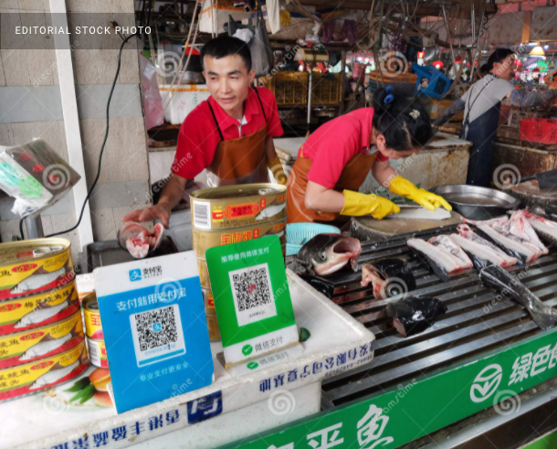
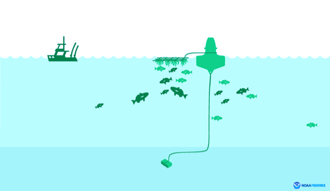
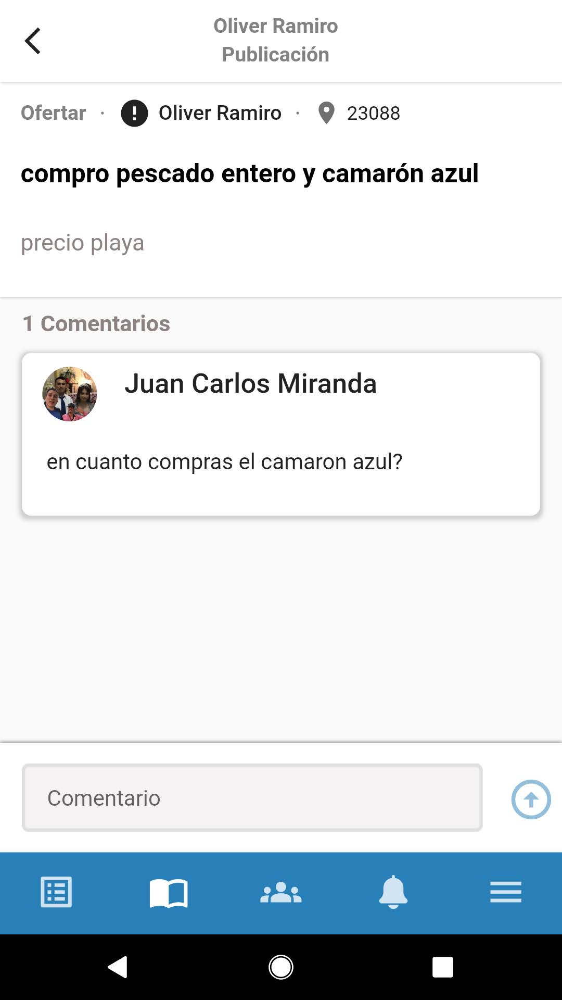
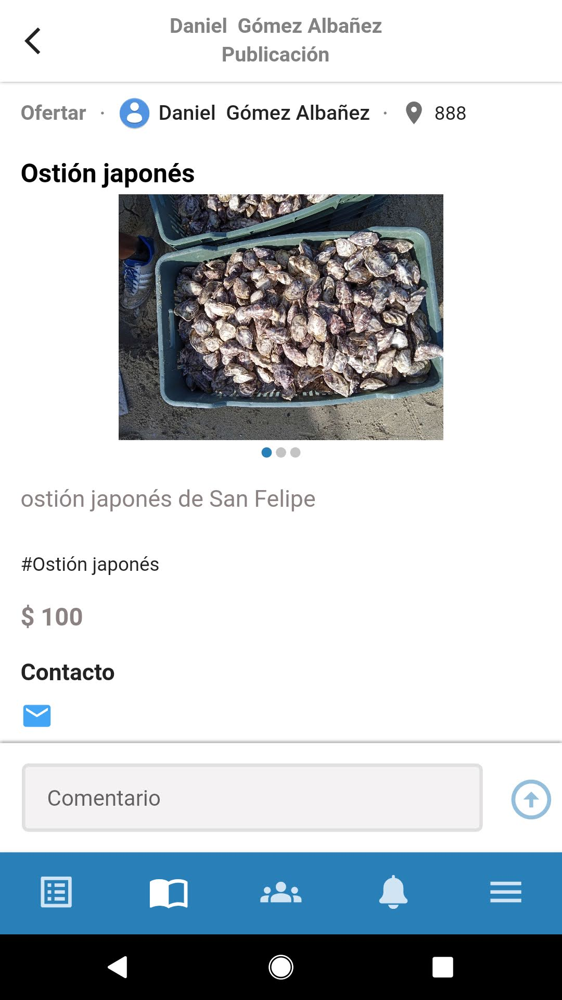

<style type="text/css">
.small {
    font-size: 70%;
    padding: 1em 4em 1em 4em;
}
</style>

<style type="text/css">
.large {
    font-size: 2rem;
    padding: 1em 1em 1em 1em;
}
</style>

```{r setup, include=FALSE, eval = T}
options(htmltools.dir.version = FALSE)
knitr::opts_chunk$set(
  fig.width=9, fig.height=3.5, fig.retina=3,
  out.width = "10%",
  cache = FALSE,
  echo = FALSE,
  message = FALSE, 
  warning = FALSE,
  hiline = TRUE
)
```

```{r xaringan-themer, include=FALSE, warning=FALSE}
library(xaringanthemer)
style_mono_accent(
  base_color = "#1c5253",
  header_font_google = google_font("Josefin Sans"),
  text_font_google   = google_font("Roboto", "400", "300i", "300b"),
  code_font_google   = google_font("Fira Mono"),
  header_h1_font_size = "2.2rem",
  header_h2_font_size = "2rem",
  text_font_size = "1.1rem",
  # link_color = "e3adac",
  header_background_auto = T,
  footnote_font_size = "0.75rem"
)
```


# Outline

- How I think about environmental problems and solutions

--

- My take on the prompt:

--

  - Access to markets & credit

--

  - Sustainable intensification
  
--

  - New institutions


---
# My approach

.center[.large[**Design and evaluation** of policy interventions and technology adoptions in the marine realm]]


--

How do these **shape human behavior** and environmental and economic **outcomes**?

--

I think about:

- Markets

- Endogeneity and Scalability

- Institutions

- Incentives (and unintended consequences)

---
class:inverse,middle
# The prompt:

### How can _emerging data and technology_ help actors in the small-scale fishery and aquaculture sectors equitably _improve their livelihoods and sustainably manage_ their resources?

---
class:inverse,middle
# My take

.pull-left[

1. Access to markets

2.New institutions

3. Sustainable intensification

4. Unintended consequences
]

---
# 1 - Access to markets and credit

.footnote[[1]Kimai et al., 2020, _Mar Pol_; [2] Short et al., 2021, _Nature Food_]

.pull-right[]

Access:

  .pull-left[- Consistently identified as constraints]

  <!-- - Promotes "thin" markets -->

  <!-- - Perpetuates dependencies -->
--

  .pull-left[- Inherently different, but similar limitations and implications]
  
  


---
# 1 - Access to markets and credit

.footnote[[1]Kimai et al., 2020, _Mar Pol_; [2] Short et al., 2021, _Nature Food_]

.pull-right[]

Access:

  .pull-left[- Consistently identified as constraints]

  <!-- - Promotes "thin" markets -->

  <!-- - Perpetuates dependencies -->

  .pull-left[- Inherently different, but similar limitations and implications]

Digital platforms:

- Connect producers with consumers at various stages
 <!-- To sell products and services -->

---
# 1 - Access to markets and credit

.footnote[[1]Kimai et al., 2020, _Mar Pol_; [2] Short et al., 2021, _Nature Food_]

.pull-right[]

Access:

  .pull-left[- Consistently identified as constraints]

  <!-- - Promotes "thin" markets -->

  <!-- - Perpetuates dependencies -->

  .pull-left[- Inherently different, but similar limitations and implications]

Digital platforms:

- Connect producers with consumers at various stages
 <!-- To sell products and services --> 
 
- Help build a data-backed financial history

???
- Facilitate payments and micro-loans
- Incentivize formal banking


--

- Reward sustainable practices

--

- Better-suited for traceability protocols (_e.g._ [GDST](https://traceability-dialogue.org/what-is-the-global-dialogue/))

---
# 2 - New institutions

- Vessel tracking allowed vessel-day scheme

- Real-time monitoring of catch:

  - Improved data = improved fisheries management
  
  - Reduction in IUU
  
  - Global Dialogue on Seafood Traceability

- Reduce labor violations

---
# Sustainable intensification

# _Sustainable_ intensification of aquaculture

.footnote[[1] Tilman et al., 2011, _PNAS_; [2] Short et al., 2021, _Nature Food_]

.pull-left[
- The concept comes from agriculture, seeking to "close the yield gap" <sup>1</sup>
{{content}}
]

--

- Combination of:

  - New technological developments
  
  - Adoption (transfer) of existing technological developments
{{content}}
--

> How can technology transfer & improvement help close the gap?

--

.pull-right[

Level of technology is highly variable <sup>2</sup>
{{content}}

]

--
- Scoot?

---
# Unintended consequences: Technological addoption in the Caribbean

.footnote[[1] Wilson et al., _In Press_, _Front in Mar Sci_]

.pull-right[.small[noaa.gov]]


Moored Fish Aggregating Devices<sup>1</sup>

--

.pull-left[- Transfer fishing pressure from coastal to pelagic resources]

--

.pull-left[- Reduce costs and risks of fishing for pelagic species]

--

.pull-left[- With proper institutions, mFADs increase profitability of the activity]

--

.pull-left[- Without proper institutions and access to markets, mFADs can exacerbate the problem]

--
<br>
>Are **institutions** and **markets** prepared for emerging data and technology?

---
# A common approach

I think about:

- Markets

- Endogeneity and Scalability

- Incentives (and unintended consequences)

- Institutions


---
class:inverse,center,middle
# END

---
# In Depth

###[Access to markets](#markets)

###[New institutions](#institutions)

###[Sustainable intensification](#intensification)

###[Unintended consequences](#unintended)

###[One and the same?](#actors)


---
name:markets
class:inverse,center,middle
#Access to markets and credits

---
# Access to markets & credit: The challenges

.footnote[[1]Kimai et al., 2020, _Mar Pol_; [2] Short et al., 2021, _Nature Food_]

.pull-left[
The challenges:

- Consistently identified as a constraint<sup>1</sup>
{{content}}
]

--

- Actors currently employ diverse strategies<sup>2</sup>
{{content}}

--

- Inherently different, but similar limitations and implications
{{content}}

--

  - Gives SSFA actors little bargainng power
  
  - Promotes "thin" markets
  
  - Perpetuates dependencies

---
# Access to markets & credit: Tech and data

.pull-left[

.small[Dreamtimes.com]
]

.pull-right[
Digital platforms:
- General:

  - e-banking
  {{content}}
]

--

  - e-payment (e.g. PayPal, Venmo, AliPay)
  {{content}}
  
--

  - Within-app payment methods (WeChat)
  {{content}}

--

- SSFA sectors:

  - [Tracey](https://tx.company/projects/tracey/) (Philipines)
  {{content}}

--

  - [PescaData](https://pescadata.org/) (Mexico --> Latin America)
  {{content}}

---
# Access to markets & credit: The _potential_ upsides

.footnote[[1] Lindgren et al., 2019 _Rapid Asia_]

.pull-left[
```{r, out.width=210}


```
.small[pescadata.org]
]

.pull-right[
Livelihood benefits:

- Connect producers with consumers at various stages (ready-supply chain)
{{content}}
]

--

- Enable diversification of livelihoods
{{content}}

--

- Help build a data-backed financial history
{{content}}
--

- Facilitate payments and micro-loans<sup>1</sup>
{{content}}

--

- Incentivize formal banking<sup>1</sup>


---
# Access to markets & credit: The _potential_ upsides

Sustainability & Management:

--

- Reward sustainable practices

--

- Traceability (e.g. [Global Dialogue on Seafood Traceability](https://traceability-dialogue.org/what-is-the-global-dialogue/))

--

- Simplify and de-centralize data collection

--

- Data for management

---
# Access to markets & credit: The _potential_ downsides

.footnote[[1] Clark & Munro 1975, _JEEM_, [2]Noack et al., , 2020. _Working paper_]

.center[**Are institutions prepared for emerging data and technology?**]

--
.pull-left[
Access to capital<sup>1</sup> and credit<sup>2</sup>:

  - **Increases** harvesting under insecure property rights
  
  - **Reduces** harvesting under secure property rights
]

--

.pull-right[
Under unregulated e-markets:

- Tracability

- IUU
]


---
name:institutions
# New institutions

---
name:intensification
class:inverse,center,middle
# Sustainable intensification

---
name:unintended
class:inverse,center,middle
# mFADs in the Caribbean


---
name:actors
class:inverse,center,middle
# Identifying actors

### Fisheries sand aquaculture: One and the same?