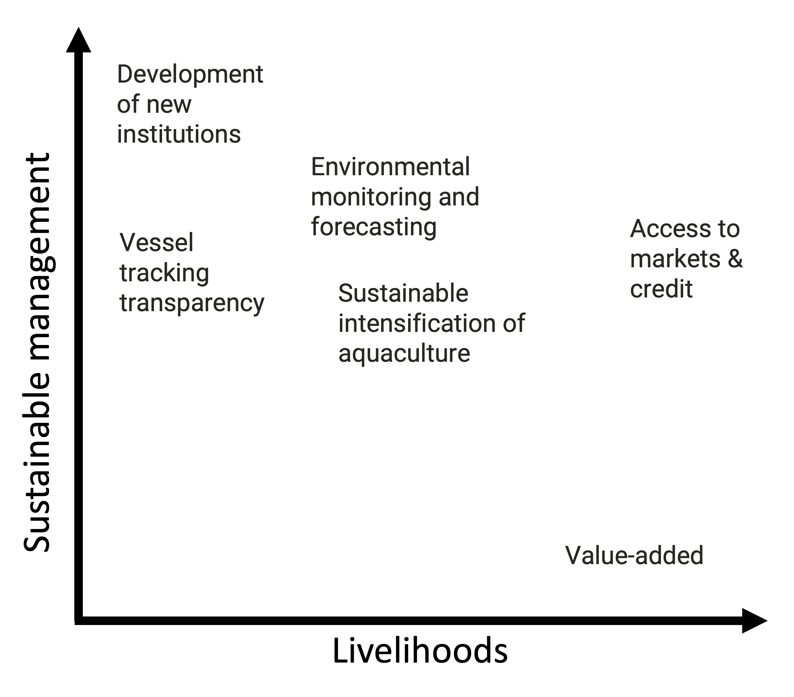

<style type="text/css">
.small {
    font-size: 70%;
    padding: 1em 4em 1em 4em;
}
</style>

<style type="text/css">
.large {
    font-size: 2rem;
    padding: 1em 1em 1em 1em;
}
</style>

```{r setup, include=FALSE, eval = T}
options(htmltools.dir.version = FALSE)
knitr::opts_chunk$set(
  fig.width=9, fig.height=3.5, fig.retina=3,
  out.width = "10%",
  cache = FALSE,
  echo = FALSE,
  message = FALSE, 
  warning = FALSE,
  hiline = TRUE
)
```

```{r xaringan-themer, include=FALSE, warning=FALSE}
library(xaringanthemer)
style_mono_accent(
  base_color = "#1c5253",
  header_font_google = google_font("Josefin Sans"),
  text_font_google   = google_font("Roboto", "400", "300i", "300b"),
  code_font_google   = google_font("Fira Mono"),
  header_h1_font_size = "2.2rem",
  header_h2_font_size = "2rem",
  text_font_size = "1.1rem",
  # link_color = "e3adac",
  header_background_auto = T,
  footnote_font_size = "0.75rem"
)
```


# Outline

- Background:

--

  - My motivations
  
  - How I think about environmental problems and solutions
  
  - Example: Recent technological adoption in the Caribbean

--

- My take on the prompt:

--

  - **Access to markets & credit**

--

  - Other pathways

---
# Background

.center[.large[**Design and evaluation** of policy interventions and technology adoptions in the marine realm]]


--

How do these **shape human behavior** and environmental and economic **outcomes**?

--

I think about:

- Markets

- Endogeneity and Scalability

- Incentives (and unintended consequences)

- Institutions

---
class:inverse,center,middle
# Why might these matter?

--

> The same _"intervention"_ can have vastly different outcomes, depending on institutional setting

--

> Self-selection confounds effect

--

> Technology and data are not a replacement of management

---
# Example: Technological addoption in the Caribbean

.footnote[[1] Wilson et al., _In Press_, _Front in Mar Sci_]

.pull-right[]

Moored Fish Aggregating Devices<sup>1</sup>

--

.pull-left[- Transfer fishing pressure from coastal to pelagic resources]

--

.pull-left[- Reduce costs and risks of fishing for pelagics]

--

.pull-left[- With proper institutions, mFADs increase profitability of the activity]

--

.pull-left[- Without proper institutions, mFADs can exacerbate the problem]

--
<br>
>Are institutions prepared for emerging data and technology?

---
class:inverse,center,middle
# The prompt:

### How can _emerging data and technology_ help actors in the small-scale fishery and aquaculture sectors equitably _improve their livelihoods and sustainably manage_ their resources?

---
# Access to markets & credit: The challenges

.footnote[[1]Kimai et al., 2020, _Mar Pol_; [2] Short et al., 2021, _Nature Food_; [3] Lindgren et al., 2019 _Rapid Asia_]

.pull-left[
The challenges:

- Consistently identified as a constraint<sup>1</sup>
{{content}}
]

--

- Diverse range of levels of adoption<sup>2</sup>
{{content}}

--

- Inherently different, but similar limitations and implications
{{content}}

--

  - Gives SSFA actors little bargainng power
  
  - Promotes "thin" markets
  
  - Perpetuates dependencies

---
# Access to markets & credit: The _potential_ solutions

.pull-left[

.small[Dreamtimes.com]
]

.pull-right[
Digital platforms:
- General:

  - e-banking
{{content}}
]

--


  - e-payment (e.g. PayPal, Venmo, AliPay)
  {{content}}
  
--

  - Within-app payment methods (WeChat)
  {{content}}

--

- SSFA sectors:

  - [Tracey](https://tx.company/projects/tracey/) (Philipines)
  {{content}}

--

  - [PescaData](https://pescadata.org/) (Mexico --> Latin America)
  {{content}}

--

  - [Global Dialogue on Seafood Traceability](https://traceability-dialogue.org/what-is-the-global-dialogue/)

---
# Access to markets & credit: The _potential_ outcomes

.pull-left[
Digital platforms can:

- Connect producers with consumers at various stages (ready-supply chain)
{{content}}
]

--

- Reward sustainable practices
{{content}}

--

- Help build a data-backed financial history
{{content}}
--

- Facilitate payments and micro-loans
{{content}}

--

- Incentivize adoption of formal banking
{{content}}

--

-	Aid in reduction of forced labor and monitor wage compliance<sup>3</sup>


---
# Access to markets & credit

.footnote[[1] Clark & Munro 1975, _JEEM_, [2]Noack et al., , 2020. _Working paper_]

###Are institutions prepared for emerging data and technology?

--
.pull-left[
Access to capital<sup>1</sup> and credit<sup>2</sup>:

  - **Increases** harvesting under insecure property rights
  
  - **Reduces** harvesting under secure property rights
]

--

.pull-right[
Under unregulated e-markets:

- Tracability

- IUU
]

---
# Other pathways

```{r, out.width=600, fig.align="center"}

```


---
# A common approach

I think about:

- Markets

- Endogeneity and Scalability

- Incentives (and unintended consequences)

- Institutions

---
# My vision as a fellow

---
# Fisheries sand aquaculture: One and the same?

---
class:inverse,center,middle
# Thanks

---
# _Sustainable_ intensification of aquaculture

.footnote[[1] Tilman et al., 2011, _PNAS_; [2] Short et al., 2021, _Nature Food_]

.pull-left[
- The concept comes from agriculture, seeking to "close the yield gap" <sup>1</sup>
{{content}}
]

--

- Combination of:

  - New technological developments
  
  - Adoption (transfer) of existing technological developments
{{content}}
--

> How can technology transfer & improvement help close the gap?

--

.pull-right[

Level of technology is highly variable <sup>2</sup>
{{content}}

]

--

---
# New institutions

- Vessel tracking and transparency and fisherie smanagement

- Global Dialogue on Seafood Traceability

